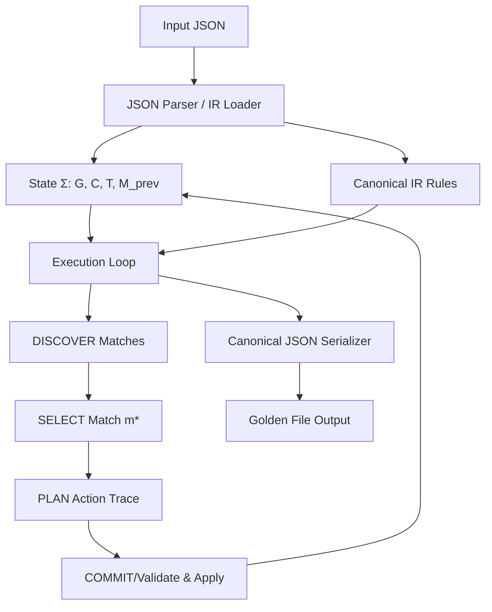

# GRISP Deterministic Kernel Delphi Implementation Plan

This document outlines the design and implementation of the GRISP Deterministic Kernel (v0.50 Unified DSOS Edition) in Delphi (Object Pascal). The engine will be compiled using `dcc64`.

## Architecture Overview

We will implement the kernel as a Delphi console application that processes an input JSON (containing the Canonical IR and initial state) and outputs a golden JSON file representing the simulation trace.



## Proposed Components and Files

All files will be created in the workspace directory: `k:\Delphi\Technology\Grisp\github version 0.17\Grisp\Implementation Test\`.

### 1. [Grisp.Core.pas](file:///k:/Delphi/Technology/Grisp/github%20version%200.17/Grisp/Implementation%20Test/Grisp.Core.pas)
Defines the primitive types, value representations, graph model, and the canonical ordering.
- **`TValType`**: Enum for value types: `vtNull, vtInteger, vtFixedPoint, vtBoolean, vtString, vtIdentifier, vtList, vtMap`.
- **`TFixedPoint`**: Struct holding `Value: Int64` and `Scale: Byte` (0..18).
- **`TIdentifier`**: Struct holding `TypeName: string` and `SequenceNumber: Int64`.
- **`TValue`**: Record with variant-like behaviour representing any GRISP value.
- **`TNode`**: Class representing a graph node (ID, Type, Fields map).
- **`TEdge`**: Class representing a graph edge (ID, Type, Src, Tgt, Fields map).
- **`TGraph`**: Class representing the property graph `G` with nodes and edges.
- **`TCounters`**: Class representing all the sequence and version counters `C` as defined in §1.
- **`TState`**: Class holding the full configuration `Σ = ⟨G, C, T, M_prev⟩`.
- **`CompareValues(const A, B: TValue): Integer`**: Implements `ORDER_CANONICAL`.

### 2. [Grisp.JSON.pas](file:///k:/Delphi/Technology/Grisp/github%20version%200.17/Grisp/Implementation%20Test/Grisp.JSON.pas)
A custom JSON parser and serializer.
- Standard libraries do not guarantee key sorting or type deduction required for GRISP (e.g., distinguishing `"12.50"` as a `FixedPoint(2)` vs a normal String, or `"Person:5"` as an `Identifier`).
- **Parser**: Hand-written recursive descent parser that reads JSON and infers:
  - Numbers as `Integer` (Int64).
  - Strings matching `^[A-Za-z_][A-Za-z0-9_-]*:[0-9]+$` as `Identifier`.
  - Strings matching `^-?[0-9]+\.[0-9]+$` as `FixedPoint` (retaining the exact number of decimal places as the scale).
  - Strings otherwise as `String`.
- **Serializer**: Formats `TValue` and states into canonical JSON (UTF-8, sorted keys, no whitespace).

### 3. [Grisp.AST.pas](file:///k:/Delphi/Technology/Grisp/github%20version%200.17/Grisp/Implementation%20Test/Grisp.AST.pas)
Defines the AST for Expressions, Constraints, Patterns, Let bindings, Actions, and Rules.
- **`TExpr`**: AST classes for literals, variables, field accesses, binary operators, `len`, `to_fixed`, and `to_integer`.
- **`TConstraint`**: AST classes for constraints.
- **`TPattern`**: AST class representing a single match pattern (Node/Edge).
- **`TLetBinding`**: Represents `Let(x, e)`.
- **`TAction`**: AST classes for primitive actions (CreateNode, CreateEdge, UpdateField, DeleteEdge, DeleteNode, EmitEvent).
- **`TRule`**: Represents a complete rule definition.

### 4. [Grisp.Evaluator.pas](file:///k:/Delphi/Technology/Grisp/github%20version%200.17/Grisp/Implementation%20Test/Grisp.Evaluator.pas)
Evaluates expressions and constraints under a given environment (variable bindings) and graph snapshot.
- Implements checked arithmetic for Int64 and `TFixedPoint`.
- Implements promotion of `Integer` -> `FixedPoint(0)` during `*` and `/`.
- division-by-zero, integer overflow, fixed-point scale overflow (>18) will raise a fatal engine exception.
- Fixed-point division uses `System.Numerics.TBigInteger` for intermediate values to prevent precision loss and premature overflow.

### 5. [Grisp.Engine.pas](file:///k:/Delphi/Technology/Grisp/github%20version%200.17/Grisp/Implementation%20Test/Grisp.Engine.pas)
Implements the 5 small-step operational semantics transitions.
- **`DISCOVER`**: Pattern matching via backtracking/search. Enumerates node/edge matching in `ORDER_CANONICAL` (ascending ID order). Evaluates constraints and let bindings. Records accessed graph element versions into `ℛ_m`.
- **`SELECT`**: Score computation and tie-breaking by lexicographical `match_key` order.
- **`PLAN`**: Translates rule actions to a primitive trace `α̂` and action reads. Expands `DeleteNode` to delete incident edges first (sorted canonically).
- **`COMMIT`**: Validates read versions, pre-checks counter overflows, applies `α̂` to `G`, increments versions/counters in `C`, updates `M_prev`.
- **`TICK`**: Increments `tick_counter` when no match is committed.

### 6. [GrispKernel.dpr](file:///k:/Delphi/Technology/Grisp/github%20version%200.17/Grisp/Implementation%20Test/GrispKernel.dpr)
Main console program entry point. Handles CLI parameters, loads input, runs the simulation loop, catches fatal exceptions, and writes the output golden file.

---

## Technical Details & Specific Rules Implementation

### Fixed-Point Arithmetic
- **Multiplication (`x * y`)**:
  - If both are Integers: standard Int64 multiplication with overflow check.
  - If mixed: promote Integer to `FixedPoint(0)`.
  - If both are FixedPoints ($V_1$ scale $S_1$ and $V_2$ scale $S_2$):
    - Result scale is $S_1 + S_2$. If $S_1 + S_2 > 18$, raise type/fatal error.
    - Result raw value is $V_1 \times V_2$ checked for Int64 overflow.
- **Division (`x / y`)**:
  - If mixed: promote Integer to `FixedPoint(0)`.
  - If both are FixedPoints ($V_1$ scale $S_1$ and $V_2$ scale $S_2$):
    - Result scale is $S_1$.
    - Result raw value is $(V_1 \times 10^{S_2}) / V_2$.
    - Since $V_1 \times 10^{S_2}$ can overflow Int64, we perform this multiplication and division using `TBigInteger` (from `System.Numerics`), then check that the final quotient fits within Int64 limits.
- **Integer Division (`x // y`)**:
  - Both must be Integers. Performs standard truncating division.

### Canonical Ordering (`ORDER_CANONICAL`)
Comparison of two `TValue` values $A$ and $B$:
- If types differ: we define a total order over types (`vtNull < vtInteger < vtFixedPoint < vtBoolean < vtString < vtIdentifier < vtList < vtMap`).
- If both are `vtString`: UTF-8 byte-by-byte lexicographical comparison.
- If both are `vtIdentifier`: Compare `TypeName` lexicographically. If equal, compare `SequenceNumber` numerically.
- If both are `vtList`: Element-by-element lexicographical comparison.
- If both are `vtMap`: Sort keys of both maps using `ORDER_CANONICAL`. Compare key-value pairs.
- If both are `vtInteger` or `vtFixedPoint` (with same scale): Numeric comparison of raw values.

---

## Verification Plan

### Automated Verification
We will write a set of automated test cases in the Pascal codebase itself (or a simple runner unit) that verifies:
1. `ORDER_CANONICAL` comparisons.
2. Checked arithmetic and promotions (underflow, overflow, division by zero).
3. JSON parser/serializer (including canonical key sorting).
4. Pattern matching engine on a sample graph.
5. Operational transitions (TICK, DISCOVER, SELECT, PLAN, COMMIT).

We will compile the engine with `dcc64.exe` using a command line such as:
```cmd
dcc64 -Q -W GrispKernel.dpr
```
and then execute the binary against sample JSON scenarios to verify correctness.

### Manual Verification
- We will inspect the output JSON to ensure keys are strictly ordered lexicographically, with no extra whitespace, and correct formatting of numbers and strings.
- We will test edge cases like deleting a node with incident edges to verify the implicit deletion order.
- We will verify that fatal errors produce the exact JSON error block as specified in §7.
